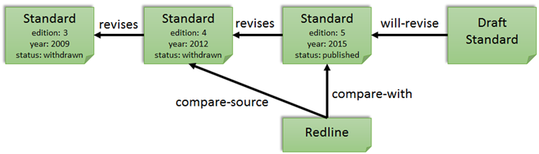

# Standard Lifecycle Ontology

This is an ontology for standards document lifecycle management. It describes the main revision cycle and any evolutions or changes to a standards document. 

The reason for creating this ontology is:
- to allow for reasoning over a the lifecycle of a standards document in order to retrieve the relevant standard documents
- to allow for the automated creation of consolidated versions

Because the lifecycle of a standard is supposed to look like this:

But in the real world it sometimes looks like this:

If the complete lifecycle of a standards document, all standard documents, and the requirements contained therein are FAIR, then it must be possible to create consolidated versions automatically. To learn more about FAIR requirements, see the [SPEC ontology](https://github.com/Netherlands-Standardization-Institute/spec).

